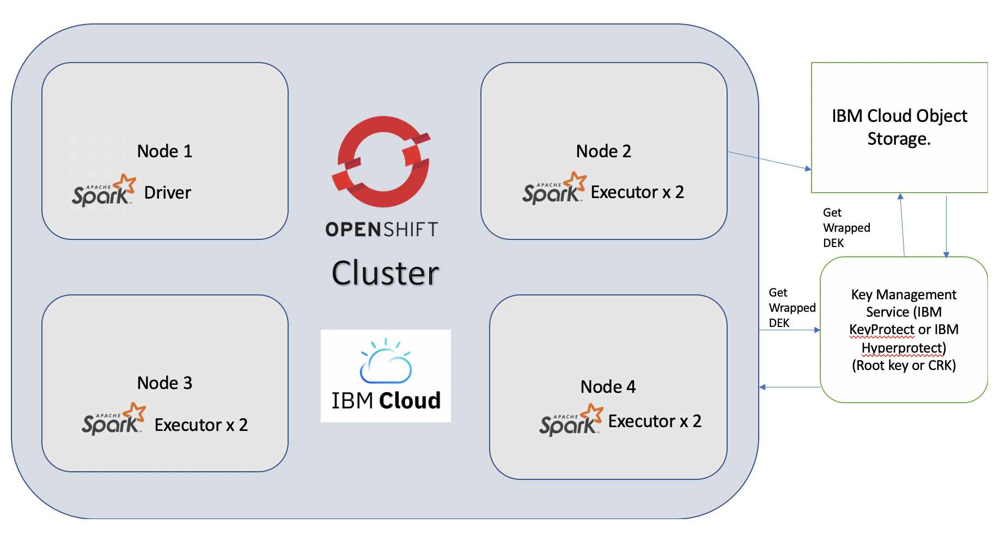

# Securely access your data in Spark with `Keep Your Own Key` and `Openshift` on IBM Cloud.

A Cloud HSM - in other words, a Hardware Security Module available for Rent. Cloud HSM is widely
 available, what does it mean for us? How can we leverage this in our applications.

A Cloud HSM is a machine with specialized cryptographic processors or accelerators, that makes cryptography 
both fast and secure. We have all heard about a very popular cryptanalysis attack, where an attacker extracts
RSA keys, by simply observing the system noise[1]. Since a dedicated Cryptographic co-processor helps in
processing all the data related to cryptography, many such tampering and cryptanalysis attack become less relevant.
So this helps makes, Cloud HSM very secure for enterprise usage. It also helps take off load from CPU, for processing
ciphering and deciphering of data and thus makes cryptography considerably faster. 

What is IBM Key Protect and IBM Hyper protect in essence?

IBM Cloud has these two unique offerings, tailored to different needs of the users.  
 a) IBM Key Protect, which is pay as you go service
and charges per API call to the KMS service. It uses a Cloud HSM instance to securely manage the Key.
 b) IBM Hyper Protect, lets you provision a dedicated instance of a Cloud HSM server machine on the cloud.
 
 Either you choose IBM Key Protect or IBM Hyper Protect, both provide a Key Management service (or KMS)
   which can integrate well with rest of the IBM Cloud services (e.g. Openshift, Cloud Object Store etc..)

There is another benefit of dedicated hardware for cryptography, i.e. they generate and store the keys on the device
 and keep them very safe. So, keys are not stored in the regular persistent storage like a system Hard drive 
or a NAS or SAN. In fact, keys are generated and stored on the dedicated crypto device, and the device have the ability to
 detect any attempt to tamper with the device, including a physical damage and auto erase the keys[2]. Therefore, any
 data that was accessible using these keys become inaccessible to anyone once the keys are erased.

So, given the value of storing a key very securely and reliably. Now can we access the big data processing system with
 a single key, i.e. all the data encryption and authentication can either be done by a single or a group of keys. All of which
 is handled by a Cloud HSM instance. In this post, we will consider some salient features of `Keep your own key`, for large
scale data processing engine like Apache Spark.

# Securely access your data in Spark with IBM Key Protect and openshift 3.11 or Openshift 4.4.

Apache Spark takes advantage of IBM's KYOK support for openshift. The following diagram describes, how at 
different stages user provided keys are used for encryption, it shows an overview of data encryption in a
 Redhat openshift cluster, using a user provided root key (CRK), managed by a Key management service (KMS) instance.
  Whether one uses a IBM block storage or IBM cloud object store, the data is encrypted by user provided root keys (CRK).
So, anything that is run on openshift, automatically benefits from the Keep your own key and the secured environment.

One of the advantage is, an application running on top of openshift with KYOK enabled, gets all the benefits of Keep
 your own key. e.g. in this case, Apache Spark is utilizing the KYOK setup, therefore one need not provide
 additional jars or libraries to make it work, an open source release of Spark is good enough to work with, and from the
 end users perspective there is no additional setup/config required.

figure: Edited from IBM Cloud docs, [link](https://cloud.ibm.com/docs/openshift?topic=openshift-encryption#encrypt_ov)

 
 Both data at rest and data in use can be encrypted, with the user provided keys (i.e. KYOK). For encrypting data in use,
 please take a look at [IBM Cloud datashield](https://cloud.ibm.com/docs/openshift?topic=openshift-encryption#datashield)

_Please note that, IBM Key protect currently only works with Openshift 4.4 and 3.11 versions._

### Prerequisites

In order to proceed with the steps in this code pattern, you should have, KMS instance running such as, 
[IBM Key protect](https://cloud.ibm.com/docs/key-protect?topic=key-protect-provision#provision) or 
[IBM Hyper protect](https://cloud.ibm.com/catalog/services/hyper-protect-crypto-services) and an Openshift 4.4 or 3.11
(Openshift 4.3 is not supported by KYOK.) cluster already up and running on IBM cloud 
[Redhat Openshift](https://cloud.ibm.com/kubernetes/catalog/about?platformType=openshift).

### Part A: Enabling KMS service for the running openshift cluster on IBM cloud.

Step 1. List the KMS instances running currently,
    
        $> ibmcloud oc kms instance ls
        OK
        Name                          ID                        Region     Service   
        test-key-protect   21fe0624-UUID-UUID-UUID-4c9c5404f4c8      us-south   Key Protect   

Please note: the ids listed here are not real. You need to check the output of running these commands on your system.

Step 2. Get the root key from the above listed, chosen KMS instance.
    
        $> ibmcloud oc kms crk ls --instance-id 21fe0624-UUID-UUID-UUID-4c9c5404f4c8
           OK
           Name   ID   
           key1   f1328360-UUID-UUID-UUID-ed0f3526a8a4
           
Step 3. Enable KMS provider, on your cluster. First you need to locate the cluster id of the already deployed 
    openshift cluster instance.
        
        $> ibmcloud oc cluster ls
        OK
        Name                         ID                     State    Created        Workers   Location          Version                   Resource Group Name   Provider   
        testing-cluster              abcd123456789          normal   3 months ago   3         xyz12             1.16.10_1533              testing               classic   

Here, abcd123456789 is my cluster id. Note: Having a running openshift cluster and a KMS service is a prerequisite here.

The command to enable kms service on my openshift cluster is,
        
        ibmcloud oc kms enable -c <cluster_name_or_ID> --instance-id <kms_instance_ID> --crk <root_key_ID> [--public-endpoint]

Substituting the values from above commands for cluster id, kms instance id, and root key id. Our effective command looks like
following.

        $> ibmcloud oc kms enable -c abcd123456789 --instance-id 21fe0624-UUID-UUID-UUID-4c9c5404f4c8 --crk f1328360-UUID-UUID-UUID-ed0f3526a8a4
        OK

Once this is done, it takes a while for this update to be actually effected.

To verify, this update was done successfully, 

        $> ibmcloud oc cluster get -c abcd123456789 | grep -e "Master Status:"
        Master Status:                  Ready (1 week ago)   

_Note: Once the master status appears as ready, you can verify that your cluster secrets are encrypted by querying
 information that is in etcd in the master [Cloud docs link](https://cloud.ibm.com/docs/openshift?topic=openshift-encryption#verify_kms)._ 

### Part B, Deploying Apache spark application to openshift cluster.

Step 1. Perform the openshift login.

        oc login
        
Step 2. Once logged in successfully, create a service account, with cluster roles to be used with spark jobs/deployments.

        $> oc create serviceaccount spark
        serviceaccount/spark created
        
        $> oc create clusterrolebinding spark-role --clusterrole=edit --serviceaccount=default:spark --namespace=default
        clusterrolebinding.rbac.authorization.k8s.io/spark-role created
        
Step 3. Now we need to locate the master URL. 

        $> kubectl cluster-info
           Kubernetes master is running at https://testing.containers.cloud.ibm.com:31310
           Heapster is running at https://testing.containers.cloud.ibm.com:31310/api/v1/namespaces/kube-system/services/heapster/proxy
           
Here the master URL is, `https://testing.containers.cloud.ibm.com:31310`

Step 4. Go to the Spark release directory and launch the spark job, 

_If you have not already downloaded the spark release, you can do so by going to: http://spark.apache.org/downloads.html_

We would, need a spark image to deploy the spark job via spark's k8s interface, to build and upload your own spark script:

        $> cd spark-release
        $> bin/docker-image-tool.sh -r my-repo -t v3.0.0 build

Here, `my-repo` is a docker public repository and you can also setup your own private or public repo using openshift.
 Details of which are out of scope for this blog. Please do check the openshift documentation 
 [link](https://docs.openshift.com/), for more details.
        
        $> bin/docker-image-tool.sh -r my-repo -t v3.0.0 push

Once the image is ready, submit the spark job as follows.
            
           $> bin/spark-submit \
            --master k8s://https://testing.containers.cloud.ibm.com:31310 \
            --deploy-mode cluster \
            --name spark-pi \
            --class org.apache.spark.examples.SparkPi \
            -c spark.kubernetes.authenticate.driver.serviceAccountName=spark \
            -c spark.kubernetes.container.image=my-repo/spark:v3.0.0 \
            local:///opt/spark/examples/jars/spark-examples_2.12-3.0.0.jar
                    
Watch for the deployed driver,

        $> oc get po -w
        spark-xyz-driver
        $> oc logs spark-xyz-driver
        3.1452

The example above comes along with Spark distribution, however one could write his
own spark application and submit using the guide on [Spark Submit](http://spark.apache.org/docs/latest/submitting-applications.html).
We have provided a java sample under the [java-template](java-template) directory. 

For the convenience of the user, this blog includes a basic ready to use guide or sample for accessing
 IBM Cloud object storage, with Apache Spark. Follow the readme under
[java-template/readme.md](java-template/readme.md) to deploy your own code using IBM Cloud object store.

More samples available at: [Spark Templates](https://github.com/ScrapCodes/spark-templates)

It is a common practice to use an object store(e.g. AWS S3) for accessing and storing data to be processed, IBM Cloud Object Store, let's 
us have the convenience of an object store along with `KYOK` for encryption i.e. it supports
integration with IBM KeyProtect and IBM HyperProtect services using a KMS interface. 
 While processing sensitive data, one should consider using IBM Cloud Object storage or
 IBM Cloud block storage `with KYOK encryption enabled`.
 The entire processing pipeline should be KYOK enabled, and not just one component, otherwise purpose of 
 having a `KYOK enabled encryption` is forfeited.
 Please checkout out, this guide for more details: 
 [IBM Cloud Object Storage - manage encryption](https://cloud.ibm.com/docs/cloud-object-storage?topic=cloud-object-storage-encryption)

# References

1. [RSA Key Extraction via Low-Bandwidth Acoustic Cryptanalysis. Daniel et al.](https://phys.org/news/2013-12-trio-rsa-encryption-keys-noise.html)
2. [HSM](https://en.wikipedia.org/wiki/Hardware_security_module)
3. https://www.openshift.com
4. [IBM Cloud datashield](https://cloud.ibm.com/docs/openshift?topic=openshift-encryption#datashield)
5. [IBM Key protect](https://cloud.ibm.com/docs/key-protect?topic=key-protect-provision#provision)
6. [Openshift documentation](https://docs.openshift.com/enterprise)
7. [IBM Hyper Protect Crypto Services](https://cloud.ibm.com/catalog/services/hyper-protect-crypto-services)
